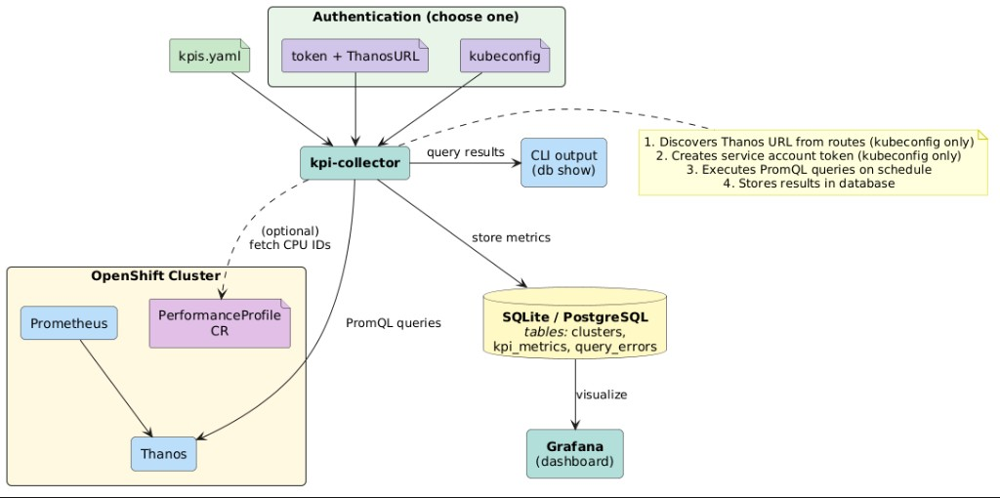
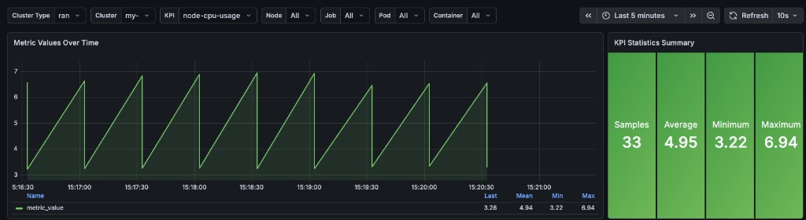

# KPI Collection Tool

CLI tool to automate KPI metrics collection from Prometheus/Thanos on
OpenShift clusters, with built-in storage and Grafana visualization.

## Motivation

Typically, developers and admins collect metrics from OpenShift clusters by running manual curl commands inside the Prometheus pod, crafting URL-encoded PromQL queries, and parsing the JSON output with `jq`:

```bash
PROM_API='http://localhost:9090/api/v1/query'
PROM_QUERY='query=rate(container_cpu_usage_seconds_total{id="/system.slice/crio.service"}[5m])'

oc exec -n openshift-monitoring prometheus-k8s-0 -- \
  curl -ks $PROM_API --data-urlencode $PROM_QUERY \
  | jq '.data.result[] | .value[0] as $ts | .value[1] as $v | {ts: ($ts | todateiso8601), value: $v}'
```

The `jq` filters plus some bash magic can produce good enough output, but this approach doesn't scale — when you need to collect dozens of KPIs repeatedly, store results over time, or share them across a team, it quickly becomes error-prone and tedious.

kpi-collector replaces this manual workflow. You define your queries in a simple YAML file, point the tool at a cluster, and it takes care of retrieving the metrics, hiding the Prometheus query issuing, and handling the subsequent parsing, storage, and visualization.

## What it does

kpi-collector connects to an OpenShift cluster, queries Prometheus/Thanos for the metrics you define in a simple YAML file, and stores the results in a local SQLite database or a PostgreSQL server. You can then query the stored data from the command line or visualize it in a pre-configured Grafana dashboard.

The tool handles all the plumbing automatically: discovering the Thanos URL, creating a short-lived service account token, scheduling repeated queries at the frequency you choose, and managing the database lifecycle. You just provide a kubeconfig and a list of PromQL queries.

> [!IMPORTANT]
> The kubeconfig must belong to a user with admin privileges or sufficient permissions to create tokens for the `prometheus-k8s` service account in the `openshift-monitoring` namespace.

Three collection modes are supported: **periodic retrieval** (collect at a set frequency over a duration), **single-shot** (`--once` — collect every KPI once and exit), and **range queries** (fetch a window of historical data points in a single call).

## Who is this for

- **Telco partners** validating KPIs on RAN, Core, or Hub OpenShift clusters
- **SREs and platform engineers** who need to capture cluster health metrics
  over time for analysis or compliance
- **Anyone** running OpenShift who wants a simple way to collect and store
  Prometheus metrics without building a pipeline

## Architecture



## Key features

- **No cluster setup required** — works with any OpenShift cluster out of the box
- **Kubeconfig auto-discovery** — automatically finds Thanos and creates a service account token
- **Built-in KPI profiles** — generate ready-to-use KPI files for RAN, Core, or Hub clusters
- **Flexible storage** — SQLite (default, zero config) or PostgreSQL
- **Grafana dashboard** — one command to launch a pre-configured dashboard
- **Single binary** — no runtime dependencies, runs on Linux and macOS

## Example: collect and query

Create a `kpis.yaml` file with the queries you want to collect:

```yaml
kpis:
  - id: node-cpu-usage
    promquery: avg by (instance) (rate(node_cpu_seconds_total{mode!="idle"}[5m]))

  - id: cluster-uptime
    promquery: sum(up)
```

Run the collector:

```bash
$ kpi-collector run \
    --cluster-name my-cluster --cluster-type ran \
    --kubeconfig ~/.kube/config --kpis-file kpis.yaml --once

KPI Collector starting...
Cluster name: my-cluster (type=ran)
Log file: kpi-collector-artifacts/kpi-2026-04-12-143000.log
Database: sqlite (kpi-collector-artifacts/kpi_metrics.db)
✓ Validated 2 KPI(s)
Discovered Thanos URL: thanos-querier-openshift-monitoring.apps.my-cluster.example.com
Created service account token (sa=prometheus-k8s, ns=openshift-monitoring, duration=10m0s)

KPI Collection Started - Single run mode

[node-cpu-usage] Sample 1/1 (single run)
  Query: avg by (instance) (rate(node_cpu_seconds_total{mode!="idle"}[5m]))
  Query Type: instant
  Status: OK - stored in database

[cluster-uptime] Sample 1/1 (single run)
  Query: sum(up)
  Query Type: instant
  Status: OK - stored in database

KPI Collection Stopped: Single run completed
All queries completed successfully!
Artifacts stored in: kpi-collector-artifacts
```

```bash
$ kpi-collector db show kpis --name node-cpu-usage --limit 3

ID  KPI_NAME        CLUSTER      VALUE     TIMESTAMP   EXECUTION_TIME       LABELS
--- ---             ---          ---       ---         ---                  ---
1   node-cpu-usage  my-cluster   0.034200  1744467000  2026-04-12 14:30:00  {"instance":"worker-0"}
2   node-cpu-usage  my-cluster   0.012800  1744467000  2026-04-12 14:30:00  {"instance":"worker-1"}
3   node-cpu-usage  my-cluster   0.069400  1744467000  2026-04-12 14:30:00  {"instance":"master-0"}

Total results: 3
```

## Grafana dashboard



## Command Map

- `kpi-collector kpis generate --profile <profile>`: generate a KPI file for a cluster profile (ran, core, hub)
- `kpi-collector run`: collect KPI metrics
- `kpi-collector db show`: query collected data
- `kpi-collector db remove`: remove stored data
- `kpi-collector grafana start|stop`: manage local Grafana dashboard

## Documentation

- [Getting Started](docs/getting-started.md) — install, collect your first metrics, and verify results in 5 minutes
- [Installation](docs/installation.md) — pre-built binary, go install, or build from source
- [Collecting Metrics](docs/collecting-metrics.md) — authentication modes, behind-the-scenes details, and dynamic CPU IDs
- [KPI Configuration](docs/kpis-file-configuration.md) — KPI file format, sampling, range queries, and built-in profiles
- [Database Commands](docs/database-commands.md) — query and manage stored data
- [Grafana](docs/grafana.md) — launch and configure the Grafana dashboard
- [Troubleshooting](docs/troubleshooting.md) — common issues and solutions

## License

Apache License 2.0 — see [LICENSE](LICENSE) for details.

## AI Skill for Cursor / Claude Code

An AI agent skill is included that teaches your coding assistant how to use
kpi-collector and generate Telco-specific PromQL queries.
See [docs/ai-skill/](docs/ai-skill/) for installation and usage instructions.
