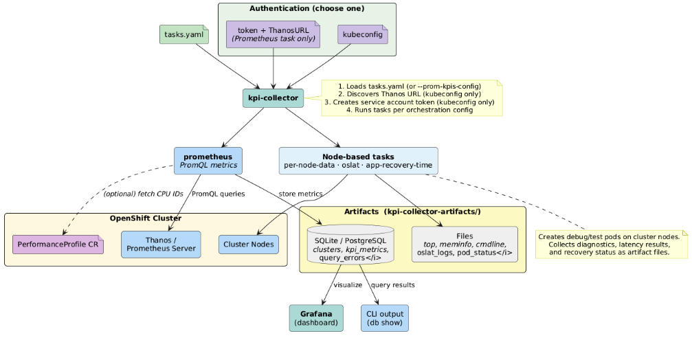
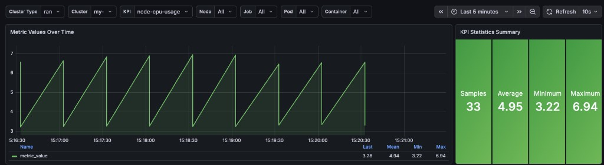

# KPI Collection Tool

CLI tool to automate KPI collection on OpenShift clusters. Define what and how to
collect in a single `tasks.yaml` file, point the tool at a cluster, and it
takes care of the rest — querying Prometheus/Thanos, running node-level
diagnostics, measuring latency, and capturing application recovery data.

## What it does

kpi-collector runs **tasks** against an OpenShift cluster and produces KPI
artifacts. You configure which tasks to run and how in a `tasks.yaml` file,
then execute them with a single command:

```bash
kpi-collector run --tasks tasks.yaml \
  --cluster-name my-cluster --cluster-type ran \
  --kubeconfig ~/.kube/config
```

Four task types are available:

| Task | What it collects | Output |
|------|-----------------|--------|
| **prometheus** | PromQL metrics from Thanos | SQLite/PostgreSQL database + Grafana |
| **per-node-data** | `top`, `/proc/meminfo`, `/proc/cmdline`, pod & node describes | Artifact files per node |
| **oslat** | OS latency test results from a user-supplied pod | `oslat_logs.out` |
| **app-recovery-time** | Workload pod status after node reboot | `pod_status.out` |

Tasks run sequentially by default. Orchestration (order, failure policy,
parallel mode) is configurable in the `tasks.yaml` file.

All artifacts are stored under `./kpi-collector-artifacts/` by default
(override with `--artifacts-dir`).

> [!IMPORTANT]
> The `per-node-data`, `oslat`, and `app-recovery-time` tasks require
> `--kubeconfig` (they use the Kubernetes API to create pods, list nodes,
> etc.). The `prometheus` task can use either `--kubeconfig` (auto-discovers
> Thanos URL and creates a token) or `--token` + `--thanos-url` (manual).
> The kubeconfig must belong to a user with admin privileges — the
> non-prometheus tasks create privileged pods and list cluster nodes, and
> the prometheus task creates tokens for the `prometheus-k8s` service
> account in `openshift-monitoring`.

## Who is this for

- **Telco partners** validating KPIs on RAN, Core, or Hub OpenShift clusters
- **SREs and platform engineers** who need to capture cluster health metrics
  over time for analysis or compliance
- **Anyone** running OpenShift who wants a config-driven way to collect
  metrics and system-level data without scripting

## Architecture



## Key features

- **Multi-task orchestration** — run Prometheus collection, node diagnostics, latency tests, and recovery checks from one file
- **No cluster setup required** — works with any OpenShift cluster out of the box
- **Kubeconfig auto-discovery** — automatically finds Thanos and creates a service account token
- **Built-in KPI profiles** — generate ready-to-use Prometheus KPI files for RAN, Core, or Hub clusters
- **Flexible storage** — SQLite (default, zero config) or PostgreSQL for Prometheus metrics
- **Grafana dashboard** — one command to launch a pre-configured dashboard for Prometheus data
- **Single binary** — no runtime dependencies, runs on Linux and macOS
- **Ready-to-use task profiles** — quickstart and full validation examples under [`task-profiles/`](task-profiles/README.md)

## Quick start: multi-task run

Use a [task profile](task-profiles/README.md) to run all four tasks:

```bash
kpi-collector run \
  --tasks task-profiles/tasks-quickstart.yaml \
  --cluster-name my-cluster --cluster-type ran \
  --kubeconfig ~/.kube/config --once
```

> ⚠️ The `app-recovery-time` task reboots cluster nodes. Edit `nodeNames` in
> the recovery fragment before running, or remove it from the orchestration
> order.

## Example: Prometheus-only collection

You can also run just the Prometheus task directly without a `tasks.yaml`:

```bash
kpi-collector run \
  --cluster-name my-cluster --cluster-type ran \
  --kubeconfig ~/.kube/config \
  --prom-kpis-config prom-kpi-profiles/kpis-quickstart.yaml --once
```

Query the collected data:

```bash
$ kpi-collector db show kpis --name node-cpu-usage --limit 3

ID  KPI_NAME        CLUSTER      VALUE   TIMESTAMP            LABELS
--- ---             ---          ---     ---                  ---
1   node-cpu-usage  my-cluster   0.0342  2026-04-12 14:30:00  {"instance":"worker-0"}
2   node-cpu-usage  my-cluster   0.0128  2026-04-12 14:30:00  {"instance":"worker-1"}
3   node-cpu-usage  my-cluster   0.0694  2026-04-12 14:30:00  {"instance":"master-0"}

Total results: 3
```

### Grafana dashboard



> The database, `db show`/`db remove`, and Grafana apply to the **prometheus
> task** only. Other tasks write artifact files under `--artifacts-dir`.

### Command map

- `kpi-collector run --tasks <file>`: run configured tasks (prometheus, per-node-data, oslat, app-recovery-time)
- `kpi-collector run --prom-kpis-config <file>`: collect Prometheus metrics only (no tasks file needed)
- `kpi-collector kpis generate --profile <profile>`: generate a Prometheus KPI file for a cluster profile (ran, core, hub)
- `kpi-collector db show`: query collected data
- `kpi-collector db remove`: remove stored data
- `kpi-collector grafana start|stop`: manage local Grafana dashboard

## Documentation

- [Getting Started](docs/getting-started.md) — install and run your first collection in 5 minutes
- [Tasks Configuration](docs/tasks-configuration.md) — `tasks.yaml` schema, orchestration, and all four task types
- [Task Profiles](task-profiles/README.md) — ready-to-use quickstart and full validation task configurations
- [Installation](docs/installation.md) — pre-built binary, go install, or build from source
- [Troubleshooting](docs/troubleshooting.md) — common issues and solutions

**Task-specific configuration guides:**
- [Per-Node Data Configuration](docs/per-node-data-configuration.md) — per-node-data file format and field reference
- [Oslat Configuration](docs/oslat-configuration.md) — oslat file format and pod spec guide
- [App Recovery Time Configuration](docs/app-recovery-time-configuration.md) — app-recovery-time file format and safety guidance

**Prometheus task:**
- [Collecting Prometheus Metrics](docs/collecting-metrics.md) — authentication modes, dynamic CPU IDs, and sampling details
- [Prometheus KPI Configuration](docs/kpis-file-configuration.md) — KPI file format, range queries, and built-in profiles
- [Database Commands](docs/database-commands.md) — query and manage stored metrics
- [Grafana](docs/grafana.md) — launch and configure the Grafana dashboard

## License

Apache License 2.0 — see [LICENSE](LICENSE) for details.

## AI Skill for Cursor / Claude Code

An AI agent skill is included that teaches your coding assistant how to use
kpi-collector and generate Telco-specific PromQL queries.
See [docs/ai-skill/](docs/ai-skill/) for installation and usage instructions.
